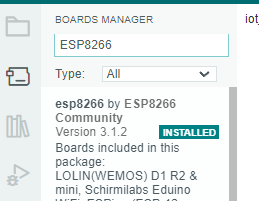
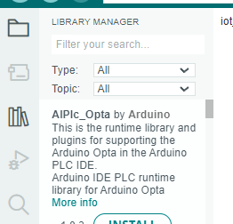

# iot-assignment
# Head Ware
## Board:
### ESP8266 nodemcu
https://randomnerdtutorials.com/esp8266-pinout-reference-gpios/
https://www.espressif.com/en/products/socs/esp8266

## Sensors
### Infrared (IR) HW-201  
https://arduinointro.com/projects/adding-sounds-to-arduino-using-the-mh-fmd-piezo-buzzer-module
https://www.bing.com/videos/search?q=hw+201&view=detail&mid=7CD651AEE9C1E02CAEDC7CD651AEE9C1E02CAEDC&FORM=VIRE

### Ultrasonic Distance Sensor - HC-SR04
https://www.bing.com/videos/search?q=hc-sr04&view=detail&mid=D780945A20B076FABC85D780945A20B076FABC85&FORM=VIRE
https://randomnerdtutorials.com/esp8266-nodemcu-hc-sr04-ultrasonic-arduino/

### RFID RC522
https://blog.csdn.net/freewebsys/article/details/104217508
https://www.instructables.com/MFRC522-RFID-Reader-Interfaced-With-NodeMCU/
https://www.aranacorp.com/en/using-an-rfid-module-with-an-esp8266/

## Other
### Buzzer MH-FMD (have not done)
https://arduinointro.com/projects/adding-sounds-to-arduino-using-the-mh-fmd-piezo-buzzer-module

### LED

### Breadboard

# IDE
## Arduino IDE
need install some things.

1.Tools > Boards Manager > search ESP8266 > install

2.Tools > Manager Libraries > search RFID_MFRC522V2 > install

# support
## Wifi
https://stackoverflow.com/questions/50080260/arduino-ide-cant-find-esp8266wifi-h-file

